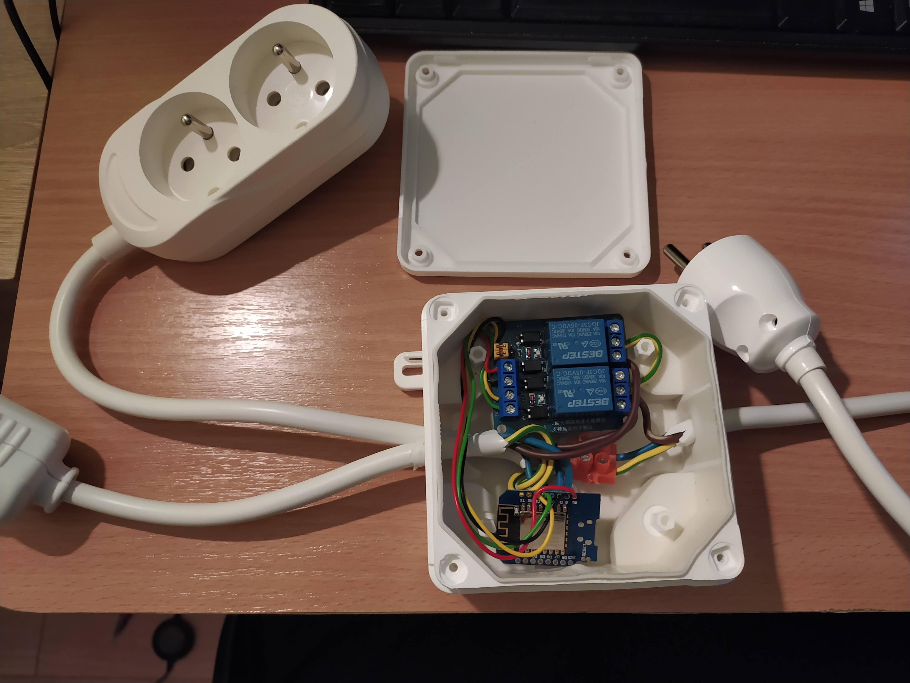
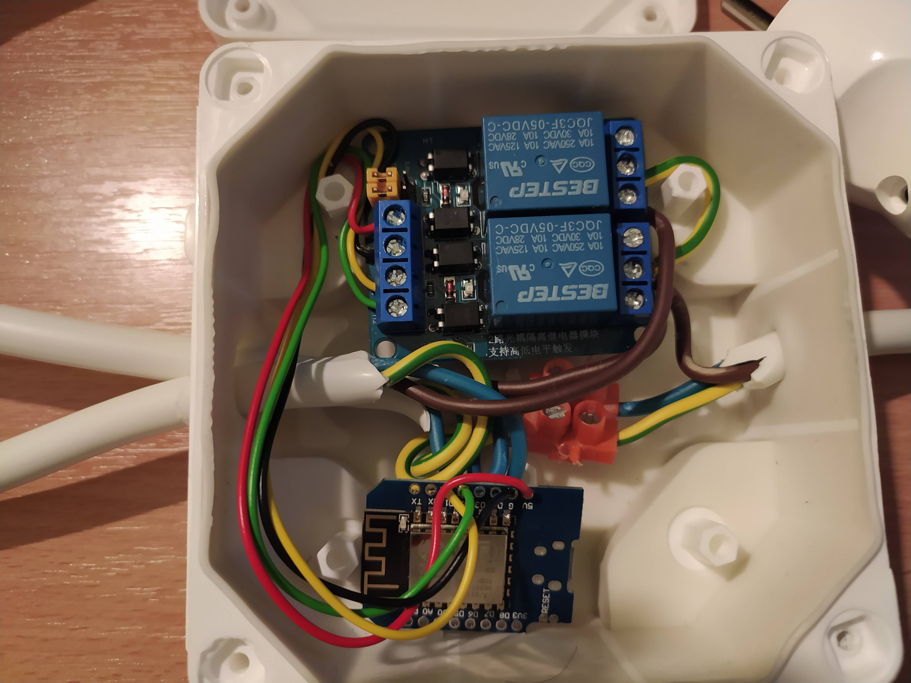
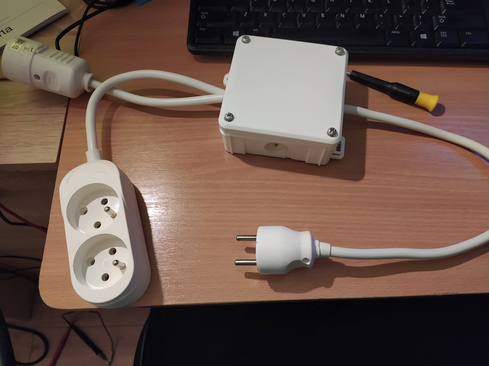
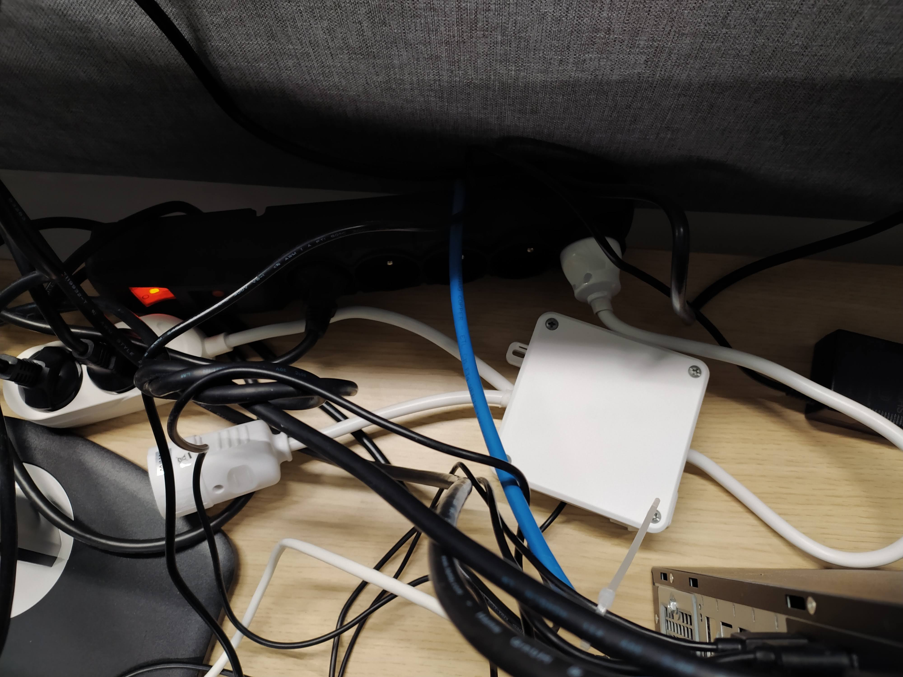
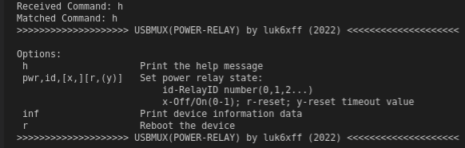

# usbmux (power-relays)
Simple Power Relay controller with UART(Serial) interface.
For USB Multiplexer functionality visit [master branch](https://github.com/luk6xff/usbmux/tree/master).

## Instalation
* Install `vscode` with `platformio` plugin (Versions: vscode[1.49.2], platformio[Core:5.0.1, Home:3.3.0])


## Building and flashing

```sh
# If you use DevWebServer in your app `#define DEV_SERVER_ON in project_config.h` run:
## Build filesystem
platformio run --target buildfs --environment d1_mini
## Upload filesystem image
platformio run --target uploadfs --environment d1_mini

# And finally build and upload the application image:
## Build the application
platformio run
## Upload the application binary
platformio run --target upload

# All in one-liner
platformio run  &&  platformio run --target buildfs --environment d1_mini  &&  platformio run --target uploadfs --environment d1_mini  &&  platformio run --target upload
```

## Pinout
* HW pinout defined at: `usbmux/app/src/hw_config.h`

## Pics
* The device:




* UART(Serial) CLI:


## BOM

| PART NAME                          | SHOP LINK                                                                                        | DATASHEET | QUANTITY | PRICE [PLN] |
|------------------------------------|--------------------------------------------------------------------------------------------------|-----------|----------|-------------|
| ESP8266 WEMOS D1-MINI | [AliExpress](https://aliexpress.com/item/32845061455.html)|[ESP8266-D1MINI](./https://docs.wemos.cc/en/latest/d1/d1_mini.html) | 1 | 7.99          |
| TS3USB221 - USB 2.0 Mux | [AliExpress](https://aliexpress.com/item/32890652381.html) |[TS3USB221](./app/lib/TS3USB221/docs/ts3usb221.pdf) | 1 | 6.00                       |
| Relay module | [AliExpress](https://aliexpress.com/item/4000295545270.html) | - | 1 | 2.09                                                                                 |
| CASE type: Z23  | [Allegro](https://allegro.pl/oferta/z-23-obudowa-z-tworzywa-84x59x30mm-polistyren-z23-8519706140) | [Z23](./docs/datasheet/Z23.pdf) | 1 | 3.39           |
| Micro USB 2.0 male connector | [Allegro](https://allegro.pl/oferta/wtyk-micro-mikro-usb-typu-b-montaz-na-kabel-0217a-8100421172) | - | 1 | 1.20                            |
| Mini USB 2.0 male connector | [Allegro](https://allegro.pl/oferta/wtyk-wtyczka-mini-usb-5p-5pin-typ-b-na-kabel-1947a-8504618684) | - | 1 | 1.40                            |
| Micro USB 2.0 female to DIP Adapter | [Allegro](https://allegro.pl/oferta/plytka-adapter-micro-usb-2-0-zenska-switch-dip-5p-8851640680) | - | 1 | 2.29                     |
| Mini USB 2.0 female to DIP Adapter | [Allegro](https://allegro.pl/oferta/plytka-adapter-mini-usb-dip-5p-wtyczka-zenska-8130118409) | - | 1 | 2.29                          |
|  |  |  |  | = 26.65                                                                                                                                                        |
